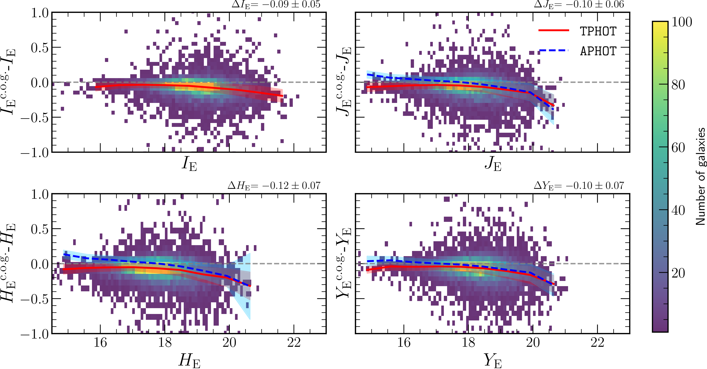
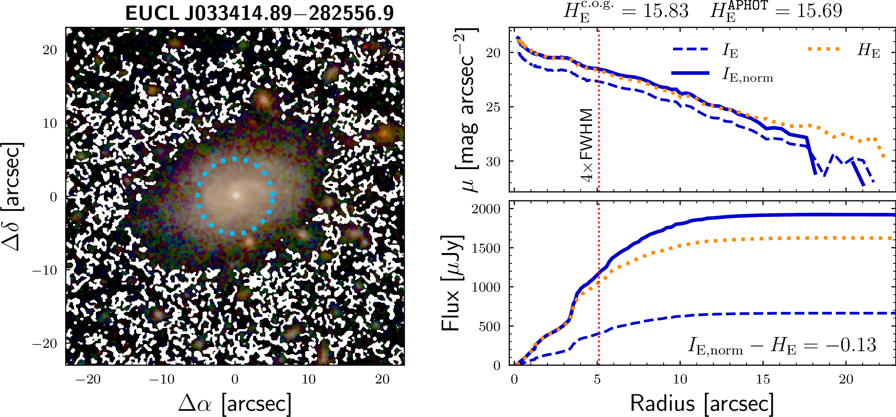

.. _mer_comparison:

Comparison with MER photometry
===============================

To validate the photometry of the pipeline, we compare our integrated magnitudes with those derived using the Multi-resolution Extractor and Resolution Matcher (MER) pipeline. MER provides a wide variety of ways to measure the photometry of a source. In addition to fixed aperture photometry, MER also provides total flux estimates (``FLUX_DETECTION_TOTAL`` column) based on the Kron radius of the detected sources on the *I*\ :sub:`E` image. 

Photometry Methods in MER
--------------------------

To extract the total flux in the other bands (*H*\ :sub:`E`, *Y*\ :sub:`E`, *J*\ :sub:`E`, and ``EXT``), the `photometry cookbook <http://st-dm.pages.euclid-sgs.uk/data-product-doc/dm10/merdpd/merphotometrycookbook.html>`_ of *Euclid* suggests scaling the total flux using a colour correction from aperture photometry (hereafter ``APHOT``) or via ``TEMPLFIT`` (hereafter ``TPHOT``). The ``APHOT`` colour correction relies on the aperture defined in terms of the FWHM. In contrast, the ``TPHOT`` colour correction uses priors from higher resolution images (VIS) to measure the photometry in other bands. 

The scaling factor for the *H*\ :sub:`E` band is as follows:

For the ``APHOT`` correction using the largest aperture (4 FWHM):

.. math::

   \frac{\texttt{FLUX\_H\_4FWHM\_APER}}{\texttt{FLUX\_VIS\_4FWHM\_APER}}

For the ``TPHOT`` correction:

.. math::

   \frac{\texttt{FLUX\_H\_TEMPLFIT}}{\texttt{FLUX\_VIS\_TO\_H\_TEMPLFIT}}

These factors are multiplied by the parameter ``FLUX_DETECTION_TOTAL`` to obtain the total flux of the source in the NIR and ``EXT`` bands (where ``EXT`` refers to the complementary optical images included in EWS from external ground-based facilities). These are the best estimates of the total flux of the source in MER.

Comparison of Asymptotic Magnitudes
------------------------------------

We compare our asymptotic magnitudes with the ``TPHOT`` apparent magnitudes for *Euclid*'s bands: *I*\ :sub:`E`, *J*\ :sub:`E`, *H*\ :sub:`E`, and *Y*\ :sub:`E`. The figure below shows the difference between our determination of the magnitudes and that of the ``TPHOT`` colour correction. The median trend is shown with the red curve. The blue curves show the median trend for the difference between our magnitudes and the ``APHOT`` photometry with MER.

   Comparison of integrated magnitudes measured with MER using the ``TEMPLFIT`` colour correction. All panels show the difference in magnitudes for our sample of galaxies (shown with a density plot) with respect to the ``TPHOT`` magnitude. Each panel shows a different *Euclid* band. The c.o.g. label refers to our asymptotic magnitudes measured using the curve of growth. The grey line indicates a null difference. The red curve shows the average of all values within bins of 0.6 magnitudes, and the grey filled regions show the mean root mean square (RMS) difference of all values and the average curve. The average difference and RMS are shown at the top right of each panel. The blue dashed curve shows the average trend for ``APHOT`` colour correction.

Results: TPHOT vs APHOT
------------------------

We find good agreement between the values reported by MER and ours, with some differences that depend on the selected colour correction. 

**TPHOT Comparison:**

In the case of ``TPHOT``, we systematically recover brighter magnitudes than MER, with a mean difference of:

- *I*\ :sub:`E`: -0.09 ± 0.05 mag
- *J*\ :sub:`E`: -0.10 ± 0.06 mag  
- *H*\ :sub:`E`: -0.12 ± 0.07 mag
- *Y*\ :sub:`E`: -0.10 ± 0.07 mag

The error is estimated as the root mean square (RMS) of the difference between all values and the mean trend curve. This difference tends to increase with the magnitude of the source, reaching ~0.2 mag at levels of 21 mag in *I*\ :sub:`E` and at 19 mag for the NIR bands.

**APHOT Comparison:**

In the case of ``APHOT`` photometry (blue curves) of NISP bands (*J*\ :sub:`E`, *H*\ :sub:`E`, and *Y*\ :sub:`E`), we find similar trends for the three bands with some correlation with the magnitude of the sources:

- For sources **brighter than 17.5 mag**: our asymptotic magnitudes tend to be fainter than the ``APHOT`` magnitudes (around ~0.05 mag).
- For sources **fainter than 17.5 mag**: we recover brighter magnitudes than ``APHOT`` (around ~0.1 mag).

Interpretation of Differences
------------------------------

These differences can be associated with the systematics in the different methodologies used to measure the integrated magnitudes and with the background subtraction calibration. Our method consists of integrating the surface brightness profiles that extend out to the region where the background is reached and extrapolating the asymptote. This technique offers a correction on the flux missed by the lack of depth of the data, and we also account for possible masked regions within the galaxy.

In addition, we include the MER background maps and recompute the background using our own methods, which may also introduce flux of the galaxy previously removed by oversubtraction effects. This flux correction and the addition of the background maps could explain the brighter sources with respect to ``TPHOT`` photometry. 

However, with respect to ``APHOT`` photometry, NISP shows two different behaviours. For the faintest sources, our magnitudes recover more flux, as expected from the same reasoning as with ``TPHOT``. For brighter sources, ``APHOT`` photometry recovers brighter sources than our method. The magnitudes for the NISP instrument are scaled using the total flux detected in *I*\ :sub:`E` and a normalisation factor from the fraction between the flux measured in the *I*\ :sub:`E` and the NIR bands that depend on the method. 

If the source is brighter, concentrated, and large enough, the aperture only covers the central region of the source, and the correction extrapolates the colour from the central region to the outskirts of the source. In most cases of galaxies, there are gradients in colours, and the normalisation term cannot reproduce the colour of the outskirts. The effect is more prominent on the brightest and largest galaxies.

Example: Color Gradient Effects
--------------------------------

We show an example of a galaxy with a brighter magnitude given by ``APHOT`` in the figure below. The left panel shows an LRGB image and the aperture of size 4 FWHM used to measure the ``APHOT`` colour correction. The top right panel shows the surface brightness profile for *I*\ :sub:`E` (blue dashed curve), *H*\ :sub:`E` (orange curve), and the normalised *I*\ :sub:`E` (blue curve) using the colour correction from MER. The bottom right panel shows the curve of growth for each profile.

   Example of the ``APHOT`` colour correction on a galaxy of our sample and the surface and cumulative brightness profile. The left panel shows an LRGB image with the aperture of 4 FWHM shown with the blue circle. The top right panel shows the surface brightness profile measured for *I*\ :sub:`E` (blue dashed curve), *H*\ :sub:`E` (orange curve), and the normalised *I*\ :sub:`E` bands using the aperture colour correction from MER. The bottom panel shows the curve of growth for those profiles. The vertical red dotted line shows the radius of the aperture. The asymptotic magnitudes and the aperture-corrected magnitudes from MER are shown above the top right panel. The difference between the normalised *I*\ :sub:`E` and the *H*\ :sub:`E` magnitudes is shown in the bottom right panel.

Around the location of the aperture, the profiles diverge, and the normalised profile overestimates the emission on the *H*\ :sub:`E` band (0.13 mag larger) due to a redder central region than the outskirts of the galaxy. This overestimation is due to tracing the colour of the central region of galaxies rather than the global colour, which explains the behaviour for bright sources (>17.5 mag) for the ``APHOT`` colour correction.

We measure the difference between *H*\ :sub:`E` and the normalised *J*\ :sub:`E` surface brightness profile for all galaxies and we find an average difference of 0.07 ± 0.06 mag that reaches up to 0.12 mag for galaxies brighter than 17.5 mag.

Recommendations
---------------

Based on our analysis:

1. **Use TPHOT colour correction**, especially for bright and large sources, as aperture corrections may be biased by colour gradients.

2. Our method recovers photometry with a scatter (~0.05–0.07 mag) **within the errors of the photometry provided by MER**, but recovers slightly more flux (~0.09–0.12 mag) than MER, especially for the fainter sources.

3. For **bright sources (>17.5 mag)**, be aware that ``APHOT`` corrections may overestimate flux due to color gradients between the central and outer regions of galaxies.