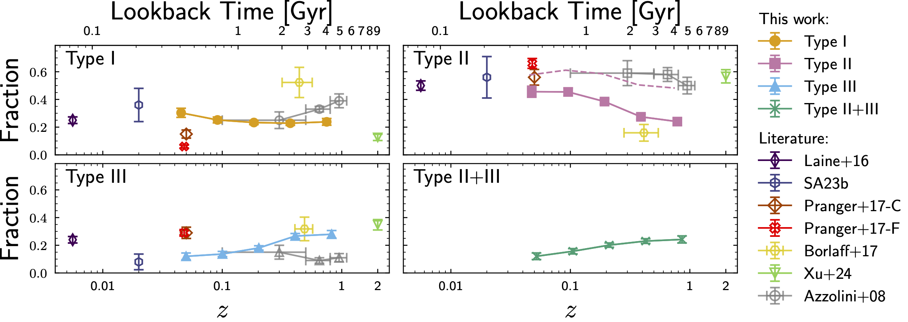
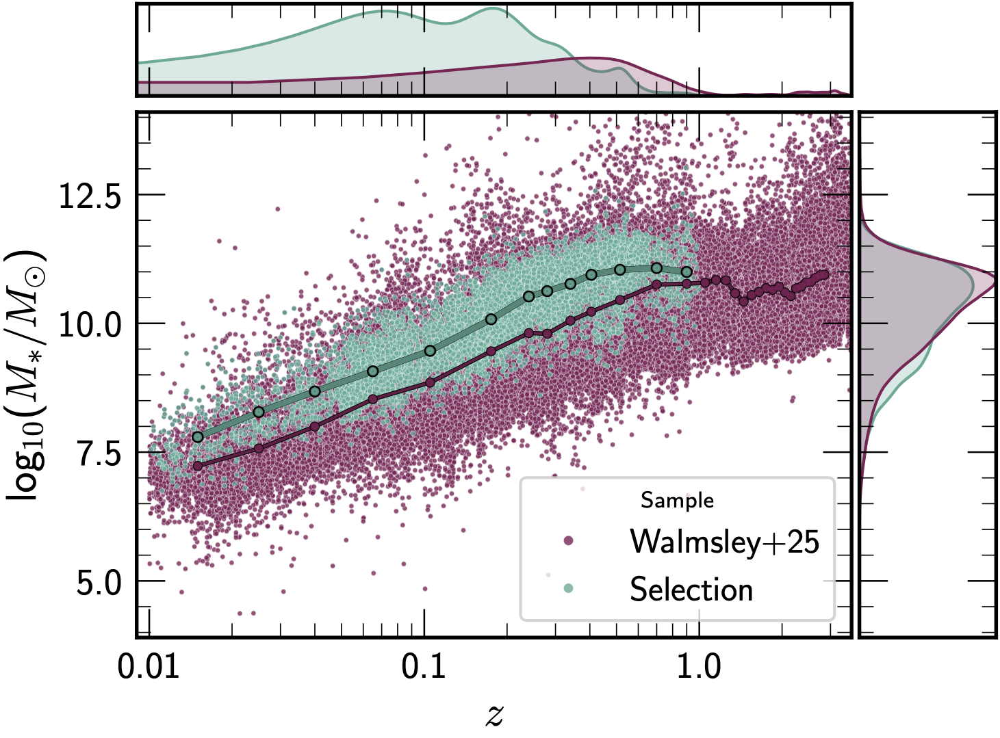

.. _science:

Scientific Background
======================

Disc breaks in surface brightness profiles
--------------------------------------------

Most of the baryonic mass and angular momentum of galaxies reside in the disc
component, making the radial distribution of stellar light a key tracer of disc
formation and evolution.  It is now well established that the radial surface
brightness profiles of disc galaxies frequently deviate from a single
exponential, displaying changes in slope referred to as **disc breaks**
(:cite:t:`Pohlen06`; :cite:t:`Erwin08`).

Following the classification scheme of :cite:t:`Pohlen06` and :cite:t:`Erwin08`,
disc galaxy profiles are divided into three categories:

.. list-table:: Disc break types
   :header-rows: 1
   :widths: 15 20 65

   * - Type
     - Nickname
     - Description
   * - **Type I**
     - Pure exponential
     - Single exponential disc spanning several scale lengths with no break
       signature.
   * - **Type II**
     - Down-bending
     - Broken exponential with a *steeper* outer slope (truncated disc).
       Dominant in the local Universe (~50 % of disc galaxies at :math:`z<0.1`).
   * - **Type III**
     - Up-bending
     - Broken exponential with a *shallower* outer slope (anti-truncated disc).
       Becomes progressively more common at higher redshift.

Composite profiles with two or more breaks, such as **Type II+III**, **Type
III+II**, **Type II+II**, and **Type III+III**, are also identified by the
pipeline (Module 5).

Physical origin
^^^^^^^^^^^^^^^

Type II breaks are most commonly associated with either **star-formation
thresholds** linked to the gas surface density (:cite:t:`Kennicutt1989`) or
with **radial stellar migration** driven by bars and other secular processes
(:cite:t:`Debattista06`).  Their brighter break surface brightness
(~23.0 mag arcsec⁻²) and their prevalence at late cosmic times support a
scenario in which dynamically settled, gas-depleted discs preferentially
develop down-bending profiles.

Type III breaks arise from a wider variety of mechanisms including **minor
mergers**, **galaxy harassment**, accretion of dark matter substructure, and
the build-up of thick discs or stellar haloes
(:cite:t:`Borlaff14`; :cite:t:`Roediger12`).  Their characteristic fainter
break level (~24.2 mag arcsec⁻²) and the increase of their frequency toward
higher redshifts are consistent with external environmental effects being
more dominant at earlier cosmic epochs.

Redshift evolution measured with *Euclid* Q1
^^^^^^^^^^^^^^^^^^^^^^^^^^^^^^^^^^^^^^^^^^^^^

Using the pipeline described in this documentation applied to 4 385 well-classified
disc galaxies out to :math:`z=1`, **Sánchez-Alarcón et al. (2026)** find:

* **Type II** profiles are the most common locally (>50 %) but decrease
  steadily with lookback time.
* **Type III** and **Type II+III** fractions rise from ~10 % at :math:`z\approx0.05`
  to ~30 % each at :math:`z\approx1`.
* The break radius correlates tightly with the outer disc scale length:
  :math:`r_\mathrm{b}/h_\mathrm{out} \approx 2.9`, irrespective of break type.

   *Evolution of the frequency of disc break types with cosmic time (lookback
   time on the upper x-axis, redshift on the lower x-axis).  Type I (top left),
   Type II (top right), Type III (bottom left), and Type II+III (bottom right).
   Results from this work are shown with filled symbols; literature values from
   Azzollini et al. (2008), Laine et al. (2014), Pranger et al. (2017),
   Sánchez-Alarcón et al. (2023), Borlaff et al. (2017), and Xu et al. (2024)
   are shown with open symbols.*

Sample selection
----------------

Galaxies are drawn from the *Euclid* Q1 Merged catalogue
(:cite:t:`EP-Aussel`; :cite:t:`Euclid-MER`) using the following criteria:

.. list-table:: Sample selection criteria
   :header-rows: 1
   :widths: 45 15 20 20

   * - Parameter
     - Label
     - Criterion
     - Remaining
   * - ``smooth-or-featured_featured-or-disk_fraction``
     - :math:`P_\mathrm{disc}`
     - > 0.6
     - 84 071
   * - ``kron_radius``
     - :math:`R_\mathrm{Kron}`
     - > 11 arcsec
     - 14 667
   * - ``phz_pp_median_redshift``
     - :math:`z`
     - < 1
     - 11 687
   * - |Δz|/z_mean
     - :math:`\Delta z`
     - < 0.01
     - **8 748**

The morphological disc probability :math:`P_\mathrm{disc}` comes from the
deep-learning catalogue of :cite:t:`Q1-SP047` using the **Zoobot** foundation
model (:cite:t:`Walmsley23-Zoobot`).

   *Stellar mass as a function of redshift.  The parent sample (violet) and the
   final disc galaxy sample (blue) are shown.  Stellar masses and redshifts are
   provided by the* ``PHZ`` *processing function.*
